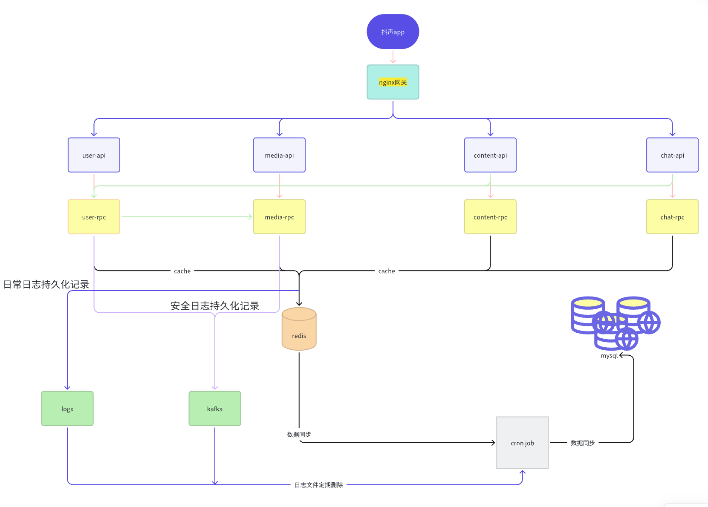

<p align="center">
  <a href="https://github.com/SixSteeds/SimpleDouyinLiuJun">
    
  </a>
</p>


<div align="center">


#

</div>

<div align="center">


# SimpleDouyinLiuJun

🎉 字节青训营《基于go-zero的微服务简化版抖音项目》 🎉

</div>

## 项目启动

#### 安装依赖

```
go mod tidy
```

#### 进入`script`目录安装本地镜像

```
docker compose -f docker-compose-env up -d
```

#### 服务启动

##### 进入`script`目录执行以下脚本

###### mac or linux

```bash
sh start_debug_LinuxMac.sh
```

###### windows 按以下顺序启动

```
所有consumer-job-contentrpc-其他rpc-所有api
```

## 业务架构图



## 预览

## 贡献者

<table>
  <tbody>
        <tr>
          <td align="center">
            <a href="https://github.com/shazi4399">
              
              <br />
              <sub>
                <b>zhang hao</b>
              </sub>
            </a>
          </td>
          <td align="center">
            <a href="https://github.com/DMJYY">
              
              <br />
              <sub>
                <b>DMJYY</b>
              </sub>
            </a>
          </td>
            <td align="center">
            <a href="https://github.com/violeit">
              
              <br />
              <sub>
                <b>violeit</b>
              </sub>
            </a>
          </td>
          </td>
            <td align="center">
            <a href="https://github.com/xingxing2064989403">
              
              <br />
              <sub>
                <b>xing xing</b>
              </sub>
            </a>
          </td>
   <td align="center">
            <a href="https://github.com/taozixun">
              
              <br />
              <sub>
                <b>陶子勋</b>
              </sub>
            </a>
          </td>
   <td align="center">
            <a href="https://github.com/liuwqTech">
              
              <br />
              <sub>
                <b>小新不吃蔬菜</b>
              </sub>
            </a>
          </td>
</tr>
</tbody>

</table>


