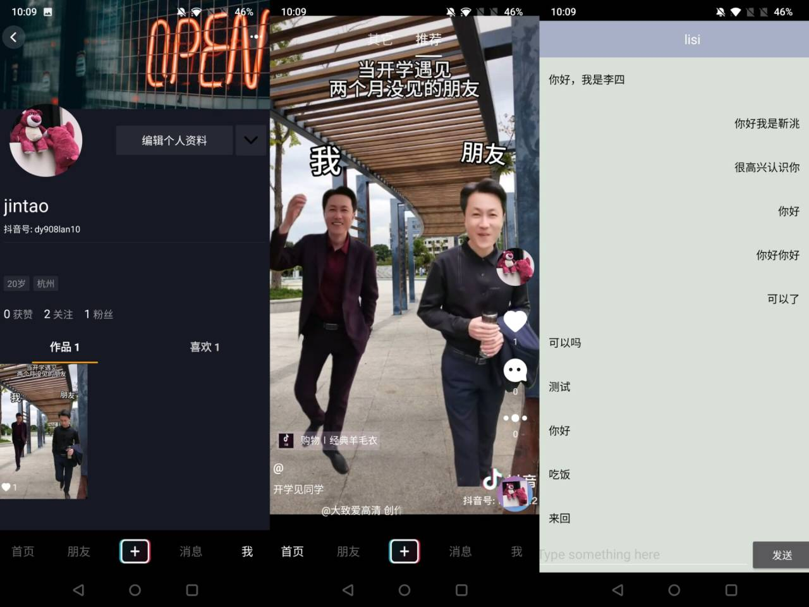

<div align="center" >
  <span>
    
  </span>
  <span>
    
  </span>
  <span>
    
  </span>
</div>

<div align="center">
</div>

<div align="center">

[中文](../README.md) | English
</div>


<div align="center">


# SimpleDouyinLiuJun

🎉 ByteDance Youth Training Camp "Simplified Douyin Project Based on go-zero" 🎉

</div>

<p align="center">
  <a href="https://k4rily1dmm.feishu.cn/docx/FlSedmvbxoDPaux8b2rcv9HNnCf" target='_blank'>Report Document</a>
  ·
  <a href="https://k4rily1dmm.feishu.cn/docx/I2q8dVSY4oIXOTxOd6PcSJLYnIg">Development Document</a>
</p>


## Project Launch

#### Install Dependencies

```
go mod tidy
```

#### Install Local Image in the `script` Directory

```
docker compose -f docker-compose-env up -d
```

#### Start Services

##### Execute the Following Scripts in the `script` Directory

###### Mac or Linux

```bash
sh start_debug_LinuxMac.sh
```

###### Windows Start in the Following Order

```
Start all consumer-job-contentrpc-other-rpc-all-api
```

## Business Architecture Diagram


## Preview



## Contributors

<table>
  <tbody>
        <tr>
          <td align="center">
            <a href="https://github.com/shazi4399">
              
              <br />
              <sub>
                <b>zhang hao</b>
              </sub>
            </a>
          </td>
          <td align="center">
            <a href="https://github.com/DMJYY">
              
              <br />
              <sub>
                <b>DMJYY</b>
              </sub>
            </a>
          </td>
            <td align="center">
            <a href="https://github.com/violeit">
              
              <br />
              <sub>
                <b>violeit</b>
              </sub>
            </a>
          </td>
          </td>
            <td align="center">
            <a href="https://github.com/xingxing2064989403">
              
              <br />
              <sub>
                <b>xing xing</b>
              </sub>
            </a>
          </td>
   <td align="center">
            <a href="https://github.com/taozixun">
              
              <br />
              <sub>
                <b>陶子勋</b>
              </sub>
            </a>
          </td>
   <td align="center">
            <a href="https://github.com/liuwqTech">
              
              <br />
              <sub>
                <b>小新不吃蔬菜</b>
              </sub>
            </a>
          </td>
</tr>
</tbody>

</table>
